Understanding the main user interface
=====================================

WORK IN PROGRESS

Overview
----------------

Open your website in a browser window. If you do not know your website URL, refer back to the `installation instructions <../Install%20Config%20Update/installing-nightscout.html>`_ you used to set up the site.

The Nightscout user interface varies in features, depending on the `configuration`_ and `settings menu`_ options you have selected. A very basic Nightscout website looks like this.

.. image:: ../Images/Simple_site.jpg
	:width: 600 px
	:alt: a simple site
	:align: center

...while a site with many features enabled looks like this.

.. image:: ../Images/enriched_site.jpg
	:width: 600 px
	:alt: a site with many features enabled
	:align: center
	

Understanding the main layout
-----------------------------

For the sake of completeness, this guide will explain all the components on a site with many features enabled. Your site is laid out into six main sections, as shown below.

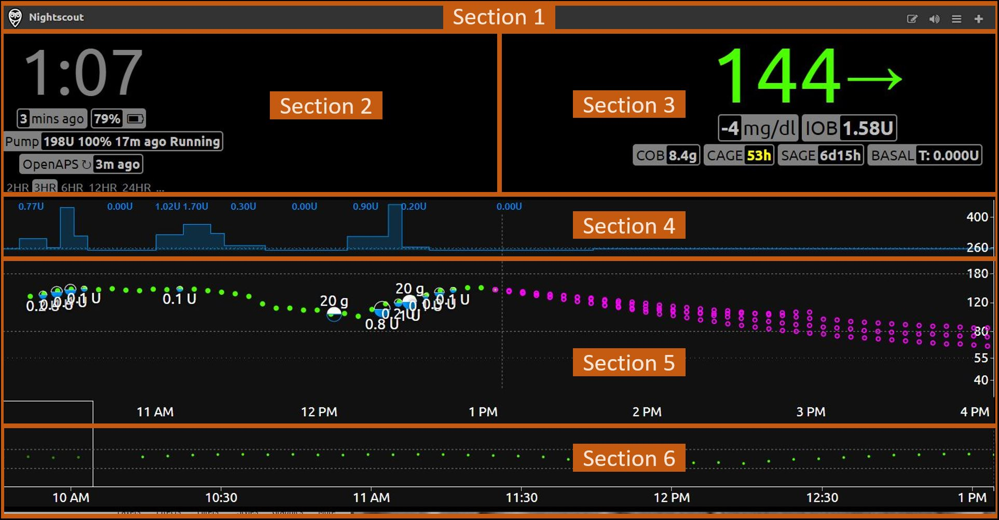

- **Section 1** is the title bar. It contains the name of your site, as well as icons for accessing certain features.
- **Section 2** shows current information about the status of various systems reporting to Nightscout or other DYI diabetes applications such as an artificial pancreas (OpenAPS or other).
- **Section 3** shows current information about you, your treatment, and the items medically attached to you.
- **Section 4** shows your basal infusion rate over time, if available.
- **Section 5** shows your glucose values over time, along with treatments such as food and insulin treatments.
- **Section 6** shows the last 48 hours of history (if available) and allows to scroll back and forth through that period.

Each section is described in further detail below.

Section 1: The title bar
------------------------

.. image:: ../Images/titlebar.jpg
   :width: 600 px
   :alt: title bar
   :align: center

Here is an explanation of the various elements in this section of the user interface:

----

	| |t1r1c1|
	| This is the title of your site. It can be changed in the `settings menu`_.

	| |t1r2c1|
	| This icon indicates that your device is locked (unauthorized) for data entry. Click on the lock to enter your API secret and unlock the site for your device.

	| |mysteryimage| or |mysteryimagered|
	| Enable (grey) or disable (red) allowing enter treatments edit mode. This icon will only be available if your device is unlocked (authorized) for data entry.

	| |t1r3c1|
	| This icon allows you to switch audio (alarms) on and off.

	| |t1r4c1|
	| This icon will open the `settings menu`_.

	| |t1r5c1|
	| This icon leads to the `care portal`_, where you can add treatments and other information.

----
	
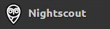
.. |t1r2c1| image:: ../Images/locked.jpg
.. |mysteryimage| image:: ../Images/mysteryimage.jpg
.. |mysteryimagered| image:: ../Images/mysteryimagered.jpg
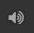
.. |t1r4c1| image:: ../Images/mainmenu.jpg
.. |t1r5c1| image:: ../Images/careportal.jpg

Section 2: Current system status
--------------------------------

.. image:: ../Images/currentsystemstatus.jpg
   :alt: current system status
   :align: center

The rounded-corner boxes in this part of the user interface are referred to as "pills". In some cases you will get additional information by hovering your mouse pointer over a pill.

Here is an explanation of the various elements in this section of the user interface:

----

	| |t2r1c1|
	| Time in your current location. You may select 12 or 24-hour format in the `settings menu`_.

	| |t2r2c1|
	| Time since the last glucose reading. The pill will change colour as the readings get older.

	| |t2r3c1|
	| Battery level of the uploader device. When hovering your mouse over this pill you see the battery levels of all devices involved in the upload process, if available.

	| |t2r4c1|
	| The status of your pump, including reservoir level, battery level, time since last status update, and status (i.e. Running or Suspended). When hovering your mouse over this pill you will see further information including active basal information.

	| |t2r5c1|
	| The time since OpenAPS last ran. When hovering your mouse over this pill you will see detailed information about the last decision made by OpenAPS.

	| |t2r6c1|
	| The timeframe of the detailed chart. Click one of the timeframes shown to select it.

	| |t2r7c1|
	| Click this menu to select whether or not to see prediction lines, and which algorithm to use: **Show AR2 forecast** shows upper and lower forecasts for the next hour based on available information. **Show OpenAPS forecast** will show various forecast lines based on the expected effects of IOB, UAM, temporary basal, etc.

----	
	
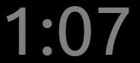
.. |t2r2c1| image:: ../Images/ago.jpg
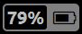
.. |t2r4c1| image:: ../Images/pumpstatus.jpg
.. |t2r5c1| image:: ../Images/openapstime.jpg
.. |t2r6c1| image:: ../Images/charttimeframe.jpg
.. |t2r7c1| image:: ../Images/predictionlinesmenu.jpg

Section 3: Current status of the person being monitored
-------------------------------------------------------

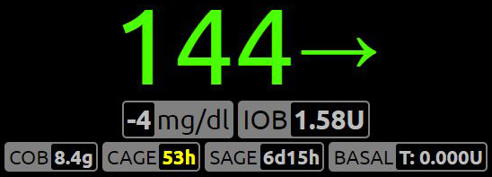

The rounded-corner boxes in this part of the user interface are referred to as "pills". In some cases you will get additional information by hovering your mouse pointer over a pill.

Here is an explanation of the various elements in this section of the user interface:

----

	| |t3r1c1|
	| The most recent glucose value available in Nightscout. You may choose to see this information in mg/dL or mmol/L format in the `settings menu`_.

	| |t3r2c1|
	| Trend arrow: A quick and easy way to read the current glucose trend. Similar to the functionality on most CGM and flash gluose monitoring systems.

	| |t3r3c1|
	| Delta: Change in glucose since the last reading.

	| |t3r4c1|
	| Amount of insulin on board based on latest information available, i.e. the amount still active based on all the bolus and basal insulin given in the last few hours. This value is calculated using the DIA (duration of insulin action) value in the `profile`_. When hovering your mouse over this pill you will see a breakdown of bolus and basal IOB.

	| |t3r5c1|
	| Amount of carbohydrate still to be converted to glucose, based on latest information available, i.e. the amount still to be converted to sugar, given all the carbs injected in the last few hours. This value is calculated using the carb activity/absorbtion rate in the `profile`_. When hovering your mouse over this pill you will see the time and amount of the last carb entry.

	| |t3r6c1|
	| Canula age: The number of hours since the latest cannula was inserted. This value is calculated based on the pump site change event as reported in the `care portal`_. When hovering your mouse over this pill you will see the date and time of the last reported cannula insertion / pump site change.

	| |t3r7c1|
	| Sensor age: The number of days and hours since the latest sensor was inserted or started. This value is calculated based on the sensor insert or sensor start event as reported in the `care portal`_. When hovering your mouse over this pill you will see the date and time of the last reported sensor insertion / sensor start.

	| |t3r8c1|
	| The current basal rate. If the rate is preceded with a T: then it is a temporary basal rate. When hovering your mouse over this pill you will see additional information including start time, duration, and time remaining.

----
	
.. |t3r1c1| image:: ../Images/glucosevalue.jpg
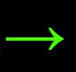
.. |t3r3c1| image:: ../Images/delta.jpg
.. |t3r4c1| image:: ../Images/iob.jpg
.. |t3r5c1| image:: ../Images/cob.jpg
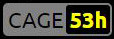
.. |t3r7c1| image:: ../Images/sage.jpg
.. |t3r8c1| image:: ../Images/basal.jpg
	 
Section 4: Basal infusion over time
-----------------------------------

If this section is not visible to you, you may enable it in the `settings menu`_, under ``Render Basal``. The image below shows the ``default`` visualisation. It is also possible to show this graph reversed vertically (upside down) using the ``icicle`` visualisation. 

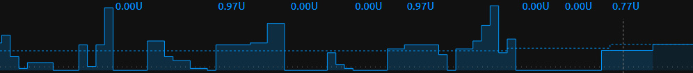

This section will show basal rates over time. The dotted line shows the normal basal rate, while the solid  line and shading shows the actual current basal rate, which may be different if a temporary basal rate is active.

Here is an explanation of the various elements in this section of the user interface:

----

	| |t4r1c1|
	| This is the basal rate represented in that part of the graph, shown as units per hour. This might also be represented as a percentage. For example, 120% would mean you are running a temporary basal rate which is 20% higher than your usual basal rate at this time. 

	| |t4r2c1|
	| This graph shows basal rate changes. The coloured-in areas under the solid lines are temporary basal rates enacted by an artificial pancreas system.

	| |t4r3c1|
	| This dashed line represents the normal basal rate at this time, as defined in your `profile`_.

----

.. |t4r1c1| image:: ../Images/basalrate.jpg
.. |t4r2c1| image:: ../Images/basalgraph.jpg
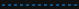

Section 5: Glucose and treatments over time
-------------------------------------------

.. image:: ../Images/glucoseandtreatmentsovertime.jpg
   :alt: glucose and treatments over time
   :align: center

This section shows your glucose curve and any insulin and glucose treatments which have been uploaded to Nightscout. The time period shown depends on the time period you have selected in section 2 above. This example shows a three hour timeframe. 

By hovering your mouse over any data point on this graph, you can get additional information about the data point.

Here is an explanation of the various elements in this section of the user interface:

----

	| |t5r1c1|
	| These are the glucose values. They will be shown in green when glucose is within the target range. The colour will change to yellow when outside the target range, or to red as values go low or high.

	| |t5r2c1|
	| This is a carb treatment. The size of the dot will be smaller or larger based on the amount of carb reported.

	| |t5r3c1|
	| This is an insulin treatment. The size of the dot will be smaller or larger based on the amount of insulin delivered.

	| |t5r4c1|
	| This vertical line separates the actual measured values, on the left, and the predicted future values, on the right.

	| |t5r5c1|
	| These dots represent predictions of next glucose based on currently-available information in Nightscout. The blue dots are predictions based on the AR2 algorithm, and the purple dots are predictions based on the OpenAPS algorithm. It is also possible to enable predictions from Loop in `configuration``_. Hovering your mouse over a dot will provide further information about the prediction. You may not have both prediction types available. Prediction lines can be switched on and off in `Section 2`_ above.
	
	| |t5r6c1|
	| These lines appear at the top and bottom of this section. The dashed lines represent the upper and lower limits of your target zone. The dotted lines represent the high and low mark. These can be customized in `configuration`_.
	
	| |t5r7c1|
	| This grey dot represents a note which has been entered manually or automatically in the treatments. Hover your mouse over the dot for further information, as shown in this image.
	
	| |t5r8c1|
	| This red dot represents a sensor calibration or finger stick blood test. Hover your mouse over the dot for further information.

	| |t5r9c1|
	| The scale at the far right of the screen shows the glucose values in mg/dL or mmol/L. The units displayed can be configured in the `settings menu`_. Also in the `settings menu`_ you can select a logarithmic, linear, or logarithmic dynamic scale.
	
----

.. |t5r1c1| image:: ../Images/glucosedots.jpg
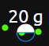
.. |t5r3c1| image:: ../Images/insulinvalue.jpg
.. |t5r4c1| image:: ../Images/verticalline.jpg
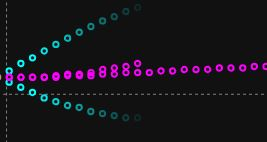
.. |t5r6c1| image:: ../Images/thresholdlines.jpg
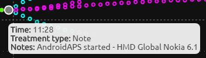
.. |t5r8c1| image:: ../Images/calibration.jpg
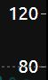

Section 6: 48-hour history
--------------------------

.. image:: ../Images/48hourfull.jpg
   :alt: glucose values over the last 48 hours
   :align: center

This section shows up to the last 48 hours of glucose history. Everything to the right of the white vertical line is shown in detail in section 5 above. Everything to the left of the white vertical line is history. 

By clicking anywhere on the history, you can change section 5 to show that period of time in detail. When doing so, all the values in sections 2, 3, and 4 will also change to reflect that specific time. The time and the glucose values will get crossed out (strikethrough), to ensure you remember you are looking at historical data and not current data. To come back to current data, simply click within the history and drag all the way to the right. You will know you are looking at current data when the time and glucose value are no longer crossed out.

.. _settings menu: ../Understanding%20your%20site/settings-menu.html
.. _care portal: ../Understanding%20your%20site/care-portal.html
.. _profile: ../Understanding%20your%20site/profile-editor.html
.. _configuration: ../Install%20Config%20Update/server-side-configuration.html
.. _Section 2: #section-2-current-system-status

----

The content on this page was derived from content initially posted here http://www.nightscout.info/wiki/welcome/website-features, with thanks to the original contributors: Gail DeVore, Greg Waehner, and Amy Cowen.

----------

All information, thought, and code described here is intended for informational and educational purposes only. Nightscout currently makes no attempt at HIPAA privacy compliance. Use of code from github.com is without warranty or support of any kind. Please review the LICENSE found within each repository for further details. Use Nightscout at your own risk, and do not use the information or code to make medical decisions.