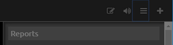
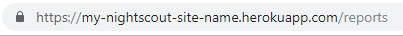
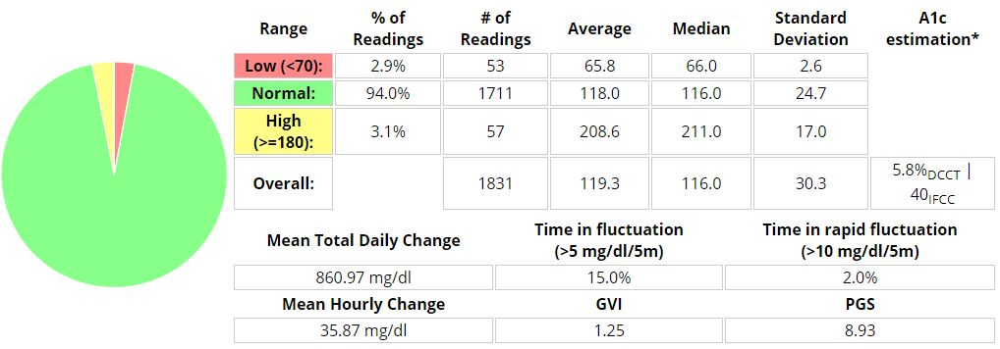
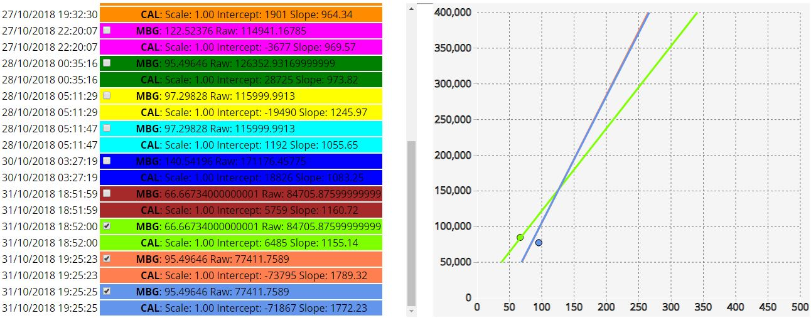
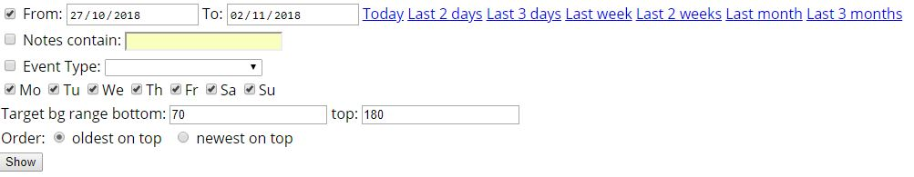
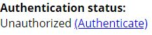

Nightscout reports
==================

This page describes the various reporting options in Nightscout.

.. image:: ../Images/reportsnightscoutreporting.jpg
   :alt: Nightscout reporting
   :align: center

Finding the reports
-------------------

Reports can be accessed in one of two ways:

- From the `settings menu`_: Click the menu and select **Reports**.

- From the URL: Enter your Nightscout site and append **/reports** to the end:

   
Report types
------------

.. image:: ../Images/reporttypes.jpg
   :alt: reports types
   :align: center

There are 9 reports available from Nightscout. Each report is available by clicking on its respective tab and pressing the **Show** button.

**Day to day** 

This report shows the blood glucose curve of each day. Additional information can also be shown, such as carbohydrates, insulin delivery, and basal rate. The image below shows an example of one day.

.. image:: ../Images/reportdaytoday.jpg
   :alt: Day to day
   :align: center
   
This is the only report to have additional customization options. You may experiment selecting the different options and clicking **Show** to see what each option adds to the report. Note, the **Size** drop down is especially useful for reducing the size of this report such that it can be printed.

.. image:: ../Images/reportdaytodayoptions.jpg
   :alt: Day to day
   :align: center

**Daily stats** 

This report shows the time in range on a day by day basis, along with other useful information like highest and lowest readings.

.. image:: ../Images/reportdailystats.jpg
   :alt: Daily stats
   :align: center

**Distribution** 

This report shows time in range over the entire selected period. It also shows an estimate of HbA1C and other useful statistics such as time in fluctuation. Click to get more in-depth information `about GVI`_ and `about PGS`_. 

**Hourly stats**

This report shows distribution of glucose over each hour of the day. If temp basals are rendered, a second table is displayed showing netIOB on a daily and hourly basis.

.. image:: ../Images/reporthourlystats.jpg
   :alt: Hourly stats
   :align: center

**Percentile chart** 

This report shows distribution of glucose over each hour of the day, in a percentile chart.

.. image:: ../Images/reportpercentilechart.jpg
   :alt: Percentile chart
   :align: center

**Weekly success** 

This report shows percentage of low, in range, and high readings on a weekly basis. This report requires a minimum of 7 days' worth of data to be available.

.. image:: ../Images/reportweeklysuccess.jpg
   :alt: Weekly success
   :align: center

**Calibrations** 

This report shows the history of sensor calibrations and how glucose values correlate to interstitial values measured by the sensor. You may graph individual calibrations by selecting the checkbox next to the label MBG.

**Treatments** 

This report allows you to view, edit or delete items in the history of treatments uploaded to Nightscout, including bolus, temp basal, and carb entries. Because this view takes longer to load, you need to click the "Show" button while on this view specifically to load it. You will only be able to edit or delete entries in this report if your device is authenticated. See the section `Authentication status`_ below.

.. image:: ../Images/reporttreatments.jpg
   :alt: Treatments
   :align: center

**Profiles**

This report shows the profiles available in Nightscout. For more about profiles, see the section `profile editor`_.

.. image:: ../Images/reportprofiles.jpg
   :alt: Profiles
   :align: center

Choosing report options
-----------------------

At the top of the Nightscout Reporting screen are customization options you may use filter the data you would like to see in the report. Note that the target bg range specified in these options will determine what the reports consider low and high readings, and are not the same as the targets you set up in your `site configuration`_ for display in the `main user interface`_.

Printing reports
----------------

Nightscout reports can be printed using your browser's "Print" function. Most reports have no print configuration options, so you will need to use your printer options to scale and/or lay out the print. Some tips:

- Nightscout reports are best printed in landscape layout.
- On the Day to day report, you can change the size of the graphs. It may be necessary to reduce the size of the graphs in order to include insulin distribution, for example.

Authentication status
---------------------

To enable site features including Care Portal and editing records in the Treatments report, you will need to ensure your device is authenticated. This section of the reporting screen shows your authentication status and allows you to authenticate or de-authenticate your current device.

You do not need to authenticate your device if all you would like to do is run and view reports.

If your device is unauthorized, click the **Authenticate** link. This will open a window asking you to enter your **API secret**, as created when you `set up and configured your site`_. You may also check a box to save your authenticated status on your device ("store hash"), so you do not need to re-authenticate each time you reopen your Nightscout site.

If you would like to de-authenticate your device, click **Remove**.

.. image:: ../Images/reportsauthenticationauthorized.jpg
   :alt: device authorized
   :align: center
   
   
----------

All information, thought, and code described here is intended for informational and educational purposes only. Nightscout currently makes no attempt at HIPAA privacy compliance. Use of code from github.com is without warranty or support of any kind. Please review the LICENSE found within each repository for further details. Use Nightscout at your own risk, and do not use the information or code to make medical decisions.

   
.. _settings menu: ../Install%20Config%20Update/configuration.html#settings-menu
.. _about GVI: https://patents.google.com/patent/EP2917856A2
.. _about PGS: https://www.ncbi.nlm.nih.gov/pmc/articles/PMC5467104/
.. _profile editor: ../Understanding%20your%20site/profile-editor.html
.. _Authentication status: ./reports.html#authentication-status
.. _set up and configured your site: ../Install%20Config%20Update/configuration.html#server-side-configuration
.. _site configuration: ../Install%20Config%20Update/configuration.html#server-side-configuration
.. _main user interface: ./main-user-interface.html