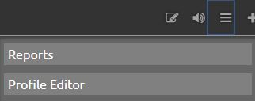
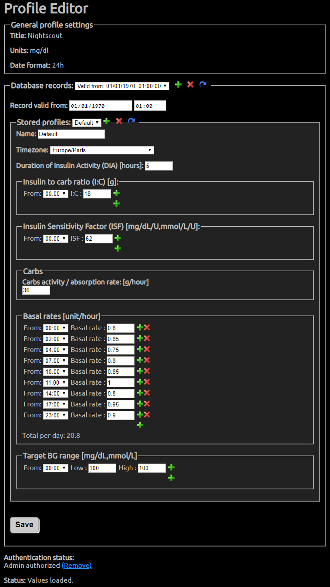

Profile editor
==============

WORK IN PROGRESS

The profile editor allows you to set up the treatment profile, which contains information about the treatment of the person being monitored.

Finding the profile editor
--------------------------

The profile editor is available in the `Settings menu <./settings-menu.html>`__.

Alternatively, you can find the profile editor by appending ``/profile`` to the end of your site name.

.. image:: profileeditorinurl.jpg
	:alt: profile editor
	:align: center

Values to be set
----------------

- ``timezone`` (Time Zone) - time zone local to the patient. *Should be set.*
- ``units`` (Profile Units) - blood glucose units used in the profile, either "mgdl" or "mmol"
- ``dia`` (Insulin duration) - value should be the duration of insulin action to use in calculating how much insulin is left active. Defaults to 3 hours.
- ``carbs_hr`` (Carbs per Hour) - The number of carbs that are processed per hour, for more information see `#DIYPS <http://diyps.org/2014/05/29/determining-your-carbohydrate-absorption-rate-diyps-lessons-learned/>`__.
- ``carbratio`` (Carb Ratio) - grams per unit of insulin.
- ``sens`` (Insulin sensitivity) How much one unit of insulin will normally lower blood glucose.
- ``basal`` The basal rate set on the pump.
- ``target_high`` - Upper target for correction boluses.
- ``target_low`` - Lower target for correction boluses.

Some example profiles are `here <https://github.com/nightscout/cgm-remote-monitor/blob/master/example-profiles.md>`__.

----------

All information, thought, and code described here is intended for informational and educational purposes only. Nightscout currently makes no attempt at HIPAA privacy compliance. Use of code from github.com is without warranty or support of any kind. Please review the LICENSE found within each repository for further details. Use Nightscout at your own risk, and do not use the information or code to make medical decisions.